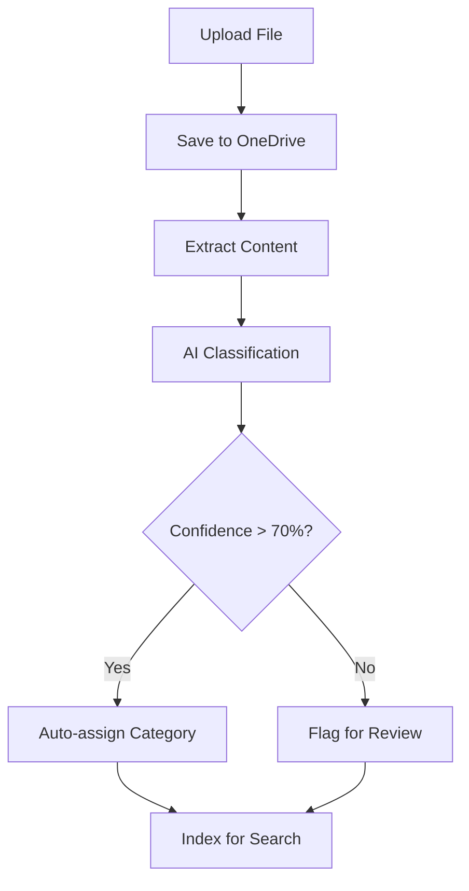
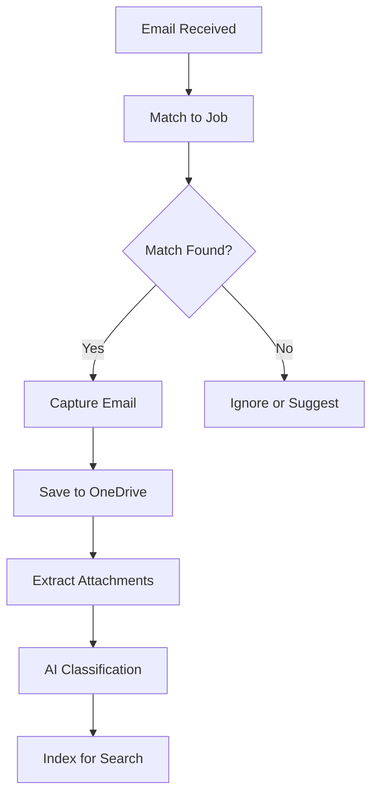

# Files & Email Consolidation

> **Entity**: File, Email  
> **Status**: 🔴 TODO  
> **Version**: V1.0

---

## Current State

> See [Current State Mapping §10.4](../00_overview/CURRENT_STATE_MAPPING.md) — Files tab in AI panel

| Element | Exists | Notes |
|---------|--------|-------|
| Files in AI panel | ✅ | Categorized: Invoices, Bills, Quotes |
| File actions | ✅ | Preview, Download |
| Emails | 🔴 | Not captured in current state |
| Folder tree | 🔴 | Not visible |
| Search | 🔴 | Not visible |

---

## Problem

Files scattered across:
- Individual inboxes (email attachments)
- Ad-hoc folders (inconsistent naming)
- Personal machines (not shared)
- Multiple systems (Simpro, Xero, WhatsApp)

Result: Nobody can find anything quickly.

---

## Solution

Unified workspace where files and emails live together, are searchable in context, and are AI-classified into standard categories.

---

## Entity Reference

See [DATA_MODEL.md → File](../00_overview/DATA_MODEL.md#file)
See [DATA_MODEL.md → Email](../00_overview/DATA_MODEL.md#email)

---

## Invariants

1. Every File has exactly one category
2. Every Email has exactly one category
3. Files stored in customer's OneDrive (not Quotech servers)
4. Email attachments extracted as separate File entities
5. Original Outlook ID preserved (no duplicate capture)
6. File version increments when same filename re-uploaded

---

## Standard Categories

| Code | Display | Purpose |
|------|---------|---------|
| `01_contracts` | Contracts | Primary contract documents |
| `02_quotes` | Quotes & Variations | Pricing documents |
| `03_invoices` | Invoices & Claims | Billing documents |
| `04_bills` | Bills & POs | Supplier documents |
| `05_site` | Site & Delivery | Site communications |
| `06_info` | Job Information | Reference materials |
| `07_qa` | QA & Compliance | Quality records |
| `other` | Other | Uncategorized |

---

## Classification Priority

| Priority | Method | Notes |
|----------|--------|-------|
| 1 | User manual | Highest authority |
| 2 | Rule-based | Filename, sender, subject patterns |
| 3 | AI classification | Content analysis |
| 4 | Default | Falls to "Other" |

---

## Workflows

### File Upload Flow



### Email Ingestion Flow



### Job Matching Rules

| Rule | Trigger |
|------|---------|
| Subject contains job number | Auto-capture |
| From/To matches job contacts | Suggest job |
| Manual forward to job inbox | Capture with context |
| Thread reply to captured email | Auto-capture to same job |

---

## Key Screens

### Files Tab

```
┌─────────────────────────────┬────────────────────────────────┐
│     Folder Tree             │        File List               │
├─────────────────────────────┼────────────────────────────────┤
│ 📁 Contracts                │ Name | Type | Modified | Cat   │
│ 📁 Quotes                   │ ────────────────────────────── │
│   └── Original              │ Quote_V1.pdf | PDF | 2 days    │
│   └── Variations            │ Contract.pdf | PDF | 1 week    │
│ 📁 Invoices                 │ Site_photo.jpg | IMG | 3 days  │
│ 📁 Bills                    │                                │
│ 📁 Site                     │                                │
│ 📁 Job Info                 │ [Upload] [Search]              │
│ 📁 QA                       │                                │
└─────────────────────────────┴────────────────────────────────┘
```

**File Actions**: Open | Preview | Move | Download | Change Category | Delete

### Emails Tab

```
┌─────────────────────────────┬────────────────────────────────┐
│     Category Filters        │        Email List              │
├─────────────────────────────┼────────────────────────────────┤
│ ▣ All (47)                  │ ┌──────────────────────────┐   │
│ ▢ Contracts (5)             │ │ From: John Smith         │   │
│ ▢ Quotes (12)               │ │ Subject: RE: Quote       │   │
│ ▢ Site (15)                 │ │ 2 hrs ago        📎 2    │   │
│ ▢ Other (15)                │ └──────────────────────────┘   │
│ ────────────────            │                                │
│ Sent (8)                    │ [Compose] [Search]             │
│ Drafts (2)                  │                                │
└─────────────────────────────┴────────────────────────────────┘
```

**Email Actions**: Read | Reply | Forward | Save Attachments | Change Category

### Combined Search

Search across files AND emails:

```
🔍 "waterproofing membrane"

FILES (12)
├─ Membrane_Spec.pdf — QA / 3 matches
├─ Quote_V1.xlsx — Quotes / 8 matches
└─ ... 10 more

EMAILS (11)
├─ RE: Membrane Selection — John Smith / 2 days ago
├─ Membrane Delivery Update — Supplier / 1 week ago
└─ ... 9 more
```

---

## Category Metadata (for AI)

Each category has metadata to guide classification:

```json
{
  "category_id": "02_quotes",
  "display_name": "Quotes & Variations",
  "purpose": "Quotes and variations with approvals",
  "keywords": ["quote", "variation", "approval", "tender", "pricing"],
  "file_patterns": ["*quote*.pdf", "*variation*.docx"],
  "email_patterns": {
    "subject_contains": ["quote", "variation", "approval"]
  }
}
```

---

## OneDrive Integration

### Read Operations
- List folders and files
- Download file content
- Get file metadata
- Watch for changes (webhooks)

### Write Operations
- Create folders
- Upload files
- Move/rename files
- Delete files

### Folder Structure Created per Job

```
/Quotech/[Company]/[JobNumber]/
├── 01_Contracts/
├── 02_Quotes/
├── 03_Invoices/
├── 04_Bills/
├── 05_Site/
├── 06_JobInfo/
└── 07_QA/
```

---

## Outlook Integration

### Read Operations
- List mail folders
- Get messages
- Get attachments
- Subscribe to new emails

### Write Operations
- Send emails
- Save drafts
- Mark read/unread

---

## Integration Points

| From | To | Data Flow |
|------|-----|-----------|
| OneDrive | File | Sync file metadata |
| Outlook | Email | Capture messages |
| Email | File | Extract attachments |
| File/Email | Search | Index content |
| AI | File/Email | Classification |

---

## AI Features

| Feature | Phase |
|---------|-------|
| Auto-classification | V1 |
| Content extraction (OCR) | V1 |
| Summary generation | V2 |
| Duplicate detection | V2 |
| Related document suggestions | V2 |

---

## Open Questions

| Question | Status |
|----------|--------|
| Attachments > 25MB? | Store reference only |
| Real-time vs batch email sync? | Webhooks preferred |
| Deleted file retention? | 30 days soft delete |
| Email send limits? | Prevent spam abuse |

---

## Acceptance Criteria

- [ ] Files tab shows all job files by category
- [ ] Folder tree navigation works
- [ ] File upload works (single and batch)
- [ ] File preview works for common types
- [ ] Emails tab shows captured emails
- [ ] Email reading with threading
- [ ] Compose and send email
- [ ] Sent emails auto-captured
- [ ] Search finds files and emails
- [ ] Category filtering works
- [ ] Manual re-categorization works
- [ ] AI classification on new content
