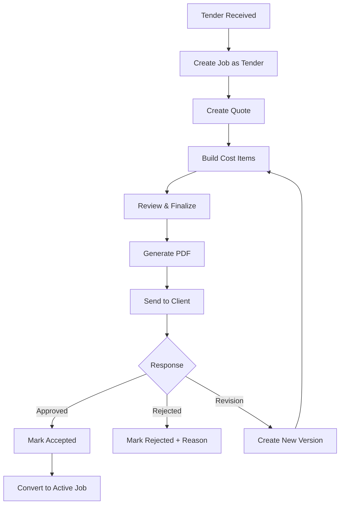
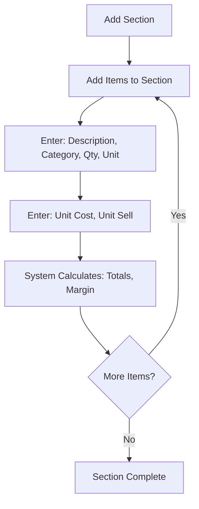

# Quotes & Tender Tracking

> **Entity**: Quote, CostItem  
> **Status**: 🔴 TODO  
> **Version**: V1.0

---

## Current State

> See [Current State Mapping §9, §14](../00_overview/CURRENT_STATE_MAPPING.md)

| Element | Exists | Notes |
|---------|--------|-------|
| Quote list with filters | ✅ | PM, Sales, Client, Status, Site, Priority |
| Quote cards | ✅ | Create/Edit with file upload |
| Status tabs | ✅ | All, Active, Archive |
| Actions menu | ✅ | Mark quoted, Allocate to job, Copy, Delete |
| Quote Sheet tab | ✅ | Line items with expandable detail |

### Existing Quote Fields

| Section | Fields |
|---------|--------|
| Identity | Title, Quote Number, Color bar |
| People | Sales person, PM, Client, Contact |
| Dates | Chased, Due, Received, Submitted |
| Financial | Estimate Value, Win Rate |
| Content | Notes with @mentions, File upload |

---

## Problem

Quotes are created in Excel, tracked in spreadsheets, and context is lost when job starts. No systematic:
- Pipeline visibility
- Win/loss tracking
- Quote-to-job data flow
- Template reuse

---

## Solution

Structured quote lifecycle from tender receipt through job conversion, with cost centre templates and AI-assisted import.

---

## Entity Reference

See [DATA_MODEL.md → Quote](../00_overview/DATA_MODEL.md#quote)
See [DATA_MODEL.md → CostItem](../00_overview/DATA_MODEL.md#costitem)

---

## Invariants

1. Quote belongs to exactly one Job
2. Quote number unique per job
3. Revisions link to parent, increment version
4. total_cost = sum(CostItems.total_cost)
5. total_sell = sum(CostItems.total_sell)
6. margin_percent = (sell - cost) / sell × 100
7. When accepted, quote data becomes job budget baseline

---

## Status Lifecycle

```
draft → sent → accepted | rejected | expired
              ↑
              └── revision (new version)
```

| Status | Meaning | Actions |
|--------|---------|---------|
| draft | Being prepared | Edit, Preview, Send |
| sent | Sent to client | Track, Revise |
| accepted | Client approved | Convert to active job |
| rejected | Client declined | Mark reason, Archive |
| expired | Past valid date | Revise or Archive |

---

## Cost Categories

Every CostItem has exactly one category:

| Category | Examples |
|----------|----------|
| `labour` | Installation hours, supervision |
| `materials` | Membrane, primer, tools |
| `plant` | Equipment hire, scaffolding |
| `subcontractor` | External trades |
| `other` | Permits, testing, contingency |

---

## Workflows

### Quote Lifecycle



### Cost Item Entry



---

## Key Screens

### Quote Pipeline View

Kanban-style columns:

| Draft | Sent | Pending | Won | Lost |
|-------|------|---------|-----|------|
| $450K | $1.2M | $380K | $2.1M | $680K |
| 3 quotes | 5 quotes | 2 quotes | 8 quotes | 4 quotes |

### Quote Editor

| Tab | Contents |
|-----|----------|
| **Details** | Number, Status, Client, Dates, Validity |
| **Cost Items** | Sections with line items |
| **Scope** | Rich text description |
| **Attachments** | Files, drawings |
| **History** | Versions, status changes |

### Cost Items Table

| Column | Notes |
|--------|-------|
| Description | What we're doing |
| Category | labour/materials/plant/subcon/other |
| Qty | Quantity |
| Unit | m², hrs, each |
| Unit Cost | Our cost |
| Unit Sell | Client price |
| Total Cost | Calculated |
| Total Sell | Calculated |

**Footer**: Total Cost | Total Sell | Markup % | Margin % | + GST | Grand Total

---

## Quote PDF Generation

Professional document with:
- Company logo and letterhead
- Quote number, date, validity
- Client and site information
- Scope description
- Cost breakdown (configurable: show/hide costs)
- Terms and conditions
- Signature block

---

## Excel Import (Quote Ingestor)

### Flow

1. Upload Excel quote
2. AI (DeepSeek) analyzes structure
3. Detect column headers
4. Map to Quotech schema
5. User reviews and confirms
6. Import to system

### Mapping Targets

| Excel Column | Maps To |
|--------------|---------|
| Description | CostItem.description |
| Quantity/Qty | CostItem.quantity |
| Unit | CostItem.unit |
| Rate/Cost | CostItem.unit_cost |
| Total | CostItem.total_cost |
| Category hints | CostItem.category |

---

## Win/Loss Tracking

When quote rejected:

| Field | Purpose |
|-------|---------|
| Lost Reason | Price, Competitor, Scope, Cancelled |
| Competitor | Who won (if known) |
| Notes | Additional context |

### Win Rate Calculation

```
Win Rate = Won Quotes / (Won + Lost) × 100
```

---

## Integration Points

| From | To | Data Flow |
|------|-----|-----------|
| Excel/PDF | Quote | Import via AI |
| Quote | PDF | Generate document |
| Quote | Email | Send and capture |
| Quote | Job | Budget baseline when accepted |
| Quote | BI | Win/loss analytics |

---

## AI Features

| Feature | Description |
|---------|-------------|
| Quote Reader | Upload Excel/PDF, AI extracts structure |
| Template Suggestion | Suggest template based on scope |
| Markup Recommendation | Suggest markup from similar quotes |
| Win Prediction | Predict probability based on history |

---

## Open Questions

| Question | Status |
|----------|--------|
| Multi-currency? | 🟢 AUD only for V1 |
| Internal approval workflow? | 🔴 TBD |
| Template sharing? | Company-wide |

---

## Acceptance Criteria

- [ ] Create quote with sections and cost items
- [ ] Edit cost items with categories
- [ ] Calculate totals, margins, GST
- [ ] Add scope description
- [ ] Attach documents
- [ ] Generate PDF
- [ ] Send via email (captured to job)
- [ ] Track status lifecycle
- [ ] Create revision from existing
- [ ] Convert accepted quote to active job
- [ ] Pipeline view shows all quotes
- [ ] Win/loss tracking with reasons
