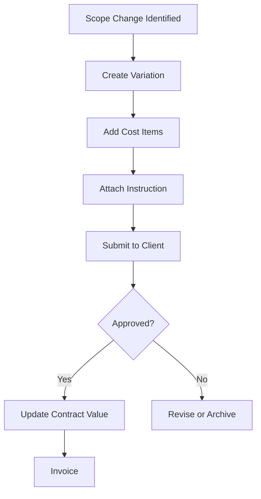
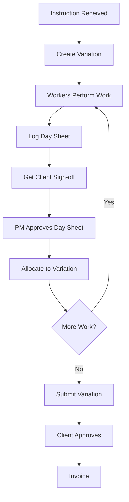
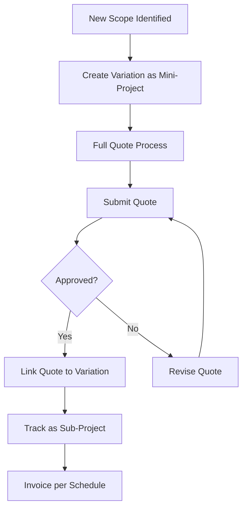

# Variation Management

> **Entity**: Variation, DaySheet  
> **Status**: 🔴 TODO  
> **Version**: V1.0

---

## Current State

> See [Current State Mapping §9.6](../00_overview/CURRENT_STATE_MAPPING.md)

| Element | Exists | Notes |
|---------|--------|-------|
| Variations in Quote Sheet | ✅ | List with quote number, hours, value |
| Variation line items | ✅ | Expandable rows |
| Day sheet references | 🟡 | Mentioned but not captured in detail |
| Approval workflow | 🔴 | Not documented |

---

## Problem

Variations are 20-40% of subcontractor revenue. Without systematic tracking:
- Revenue leaks (variations not claimed)
- Disputes (no evidence trail)
- Cash flow delays (slow approval)
- Margin erosion (untracked cost changes)

---

## Solution

Three distinct variation types with appropriate workflows:

| Type | When | Evidence | Workflow |
|------|------|----------|----------|
| **Scope Change** | Fixed-price change | Instruction + Quote | Quote → Submit → Approve → Invoice |
| **Do-and-Charge** | Time & materials | Signed Day Sheets | Work → Log → Allocate → Submit → Invoice |
| **Mini-Project** | New scope | Full Quote | Full quote process as sub-project |

---

## Entity Reference

See [DATA_MODEL.md → Variation](../00_overview/DATA_MODEL.md#variation)
See [DATA_MODEL.md → DaySheet](../00_overview/DATA_MODEL.md#daysheet)

---

## Invariants

1. Every variation has exactly one type
2. `do_and_charge` variations require at least one allocated day sheet
3. Day sheets can be allocated to at most ONE variation
4. `approved_value` flows to Job.contract_value when status = approved
5. Variation number is unique per job (V001, V002, ...)

---

## Status Lifecycle

```
draft → submitted → under_review → approved → invoiced
                         ↓
                      rejected → (revise) → submitted
```

| Status | Meaning | Actions Available |
|--------|---------|-------------------|
| draft | Being prepared | Edit, Delete |
| submitted | Sent to client | Track, Withdraw |
| under_review | Client reviewing | Chase |
| approved | Accepted | Invoice |
| rejected | Declined | Revise, Archive |
| invoiced | Billed | View only |

---

## Workflows

### Scope Change Flow



### Do-and-Charge Flow



### Mini-Project Flow



---

## Day Sheet Allocation

### Rules

1. Day sheet must be approved before allocation
2. Unallocated approved day sheets are flagged for PM review
3. Allocation links day sheet to exactly one variation
4. Once allocated, day sheet value contributes to variation total

### Day Sheet → Variation Value Calculation

```
Labour Value = Sum(worker.hours × worker.hourly_rate)
Materials Value = Sum(day_sheet.materials_total)
Variation Value = Sum(all allocated day sheets)
```

---

## Key Screens

### Variation List

| Column | Notes |
|--------|-------|
| # | V001, V002 |
| Description | Truncated |
| Type | Scope / D&C / Mini |
| Value | Estimated or approved |
| Status | With color badge |
| Action | Edit / Submit / Invoice |

**Summary Bar**: Total count | Total value | Approved value

### Variation Detail - Scope Change

| Section | Contents |
|---------|----------|
| Header | Number, Status, Type |
| Cost Items | Standard quote cost item table |
| Documents | Instruction, Emails, Photos |
| History | Status changes, Comments |

### Variation Detail - Do-and-Charge

| Section | Contents |
|---------|----------|
| Header | Number, Status, Type |
| Day Sheets | Allocated day sheets table |
| Totals | Labour hours, Labour value, Materials, Total |
| Documents | Instructions, Sign-off PDFs |

---

## Integration Points

| From | To | Data Flow |
|------|-----|-----------|
| Instruction Email | Variation | Link as source |
| Day Sheets | Variation | Allocate for D&C |
| Quote | Variation | Link for mini-project |
| Variation | Job | Update contract value |
| Variation | Invoice | Create invoice |

---

## AI/Automation

| Feature | Description |
|---------|-------------|
| Instruction Detection | Flag emails that look like variation instructions |
| Evidence Checker | Verify all required evidence before submission |
| Approval Reminder | Auto-reminder when pending > X days |

---

## Open Questions

| Question | Status |
|----------|--------|
| Can day sheet split across variations? | 🟢 No, one-to-one |
| Partial approval? | 🔴 TBD |
| Auto-create from email? | Phase 2 |

---

## Acceptance Criteria

- [ ] Create variation (all three types)
- [ ] Add cost items to scope change
- [ ] Allocate day sheets to do-and-charge
- [ ] Track status lifecycle
- [ ] Attach supporting documents
- [ ] Link to instruction email
- [ ] Calculate totals and GST
- [ ] View all variations for job
- [ ] Mark as approved with date/reference
- [ ] Generate invoice from approved variation
