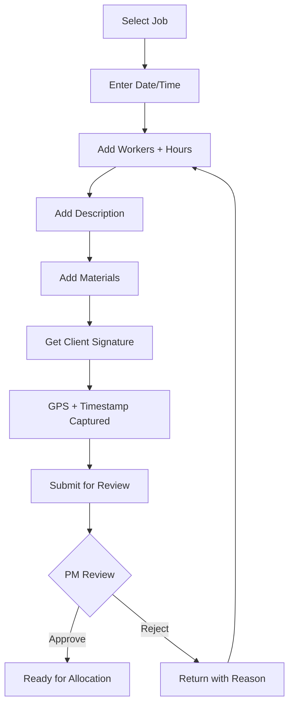
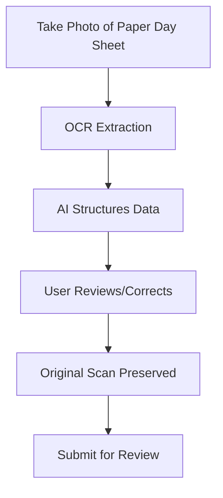

# Day Sheet Capture

> **Entity**: DaySheet  
> **Status**: 🔴 TODO  
> **Version**: V1.0 (Web) → V2.0 (Mobile + OCR)

---

## Current State

> Not captured in screenshots. Mentioned in Quote Sheet tab as evidence for variations.

---

## Problem

Day work (time & materials) is often:
- Forgotten (no systematic capture)
- Under-claimed (missing hours/materials)
- Disputed (no client sign-off)
- Delayed (paper-to-system lag)

---

## Solution

Two capture methods:

| Method | When | Technology |
|--------|------|------------|
| **Create in App** | Standard capture | Form input, digital signature |
| **Scan to Structure** | Paper day sheets | Photo → OCR → AI extraction |

---

## Entity Reference

See [DATA_MODEL.md → DaySheet](../00_overview/DATA_MODEL.md#daysheet)

---

## Invariants

1. Day sheet can be allocated to at most ONE variation
2. Submission requires client signature
3. Total hours = sum(workers[].hours)
4. Labour value = sum(workers[].hours × workers[].hourly_rate)
5. Date cannot be in future
6. At least one worker with hours > 0

---

## Status Lifecycle

```
draft → submitted → approved → allocated
               ↓
            rejected → (edit) → submitted
```

| Status | Meaning | Next Actions |
|--------|---------|--------------|
| draft | Being created | Get signature, Submit |
| submitted | Awaiting PM review | Approve/Reject |
| approved | Ready for allocation | Allocate to variation |
| rejected | Returned for edit | Fix and resubmit |
| allocated | Linked to variation | View only |

---

## Workflows

### Create in App



### Scan to Structure (V2)



---

## Data Captured

### Required Fields

| Field | Type | Notes |
|-------|------|-------|
| Job | FK | Required |
| Date | Date | Cannot be future |
| Workers | Array | At least one |
| Hours per worker | Decimal | > 0 |
| Description | Text | What was done |
| Client Name | String | Who signed |
| Client Signature | Image | Digital signature |
| Signed At | DateTime | Auto-captured |
| GPS | Point | Auto-captured |

### Optional Fields

| Field | Type | Notes |
|-------|------|-------|
| Shift Start/End | Time | For reference |
| Materials | Array | Description, qty, cost |
| Photos | Array | Work evidence |
| Hourly Rate | Decimal | Per worker |

---

## Client Sign-off Screen

Critical for evidence. Captures:

1. **Summary Display**: Job, Date, Workers, Hours
2. **Declaration Text**: "By signing, you confirm work was performed"
3. **Signature Pad**: Touch/stylus input
4. **Client Name**: Text input
5. **Auto-captured**: GPS coordinates, Timestamp, Device info

---

## PM Review Checklist

| Check | Question |
|-------|----------|
| Workers | Correct people listed? |
| Hours | Reasonable for scope? |
| Description | Clear what was done? |
| Materials | Matches work described? |
| Signature | Client signed? Valid? |
| GPS | Location near job site? |

### Review Actions

| Action | Effect |
|--------|--------|
| **Approve** | Ready for variation allocation |
| **Reject** | Returns to supervisor with reason |
| **Edit** | PM fixes minor issues directly |
| **Query** | Request more information |

---

## Value Calculations

```
Total Hours = Sum(workers[].hours)
Labour Value = Sum(workers[].hours × workers[].hourly_rate)
Materials Value = Sum(materials[].total)
Day Sheet Value = Labour Value + Materials Value
GST = Day Sheet Value × 0.10
Total = Day Sheet Value + GST
```

---

## Integration Points

| From | To | Data Flow |
|------|-----|-----------|
| Day Sheet | Variation | Allocation links evidence |
| Day Sheet | Invoice | Value flows to billing |
| Day Sheet | Job P&L | Hours feed labour tracking |
| Timesheet | Day Sheet | Optional sync (avoid double-count) |

---

## OCR + AI Extraction (V2)

| Step | Technology |
|------|------------|
| Image capture | Camera API |
| OCR | Google Vision / AWS Textract |
| Structure | DeepSeek / GPT parsing |
| Validation | Pattern matching + user review |

### AI Extraction Targets

- Date
- Worker names
- Hours per worker
- Materials list
- Description of work
- Signature detection

---

## Key Screens

### Day Sheet List

| Column | Notes |
|--------|-------|
| Date | Work date |
| Job | Job name/number |
| Hours | Total hours |
| Workers | Count |
| Signed | ✓/✗ |
| Status | Badge |

**Summary**: This week total hours | Count | Approved count

### New Day Sheet (Mobile)

Optimized for phone:
- Large touch targets
- Minimal typing
- Quick worker selection
- Easy signature capture
- Offline support (V2)

### Review Screen (PM)

Full details with:
- Worker breakdown
- Materials list
- Description
- Client sign-off details
- View original scan (if OCR)
- Approve/Reject buttons
- Variation allocation dropdown

---

## Open Questions

| Question | Status |
|----------|--------|
| Require GPS for all? | 🔴 TBD - fallback if no signal |
| Maximum hours per day? | Flag > 12 hours |
| Day sheet without client? | Allow draft, require sign later |

---

## Acceptance Criteria

### V1 (Web)

- [ ] Create day sheet on web
- [ ] Add workers and hours
- [ ] Add materials
- [ ] Add description
- [ ] Capture client signature
- [ ] Record GPS and timestamp
- [ ] Submit for review
- [ ] PM can approve/reject
- [ ] Allocate to variation
- [ ] Generate PDF evidence
- [ ] View history

### V2 (Mobile + OCR)

- [ ] Native mobile app
- [ ] Offline support with sync
- [ ] OCR scan capture
- [ ] AI data extraction
- [ ] Auto-suggest from GPS
