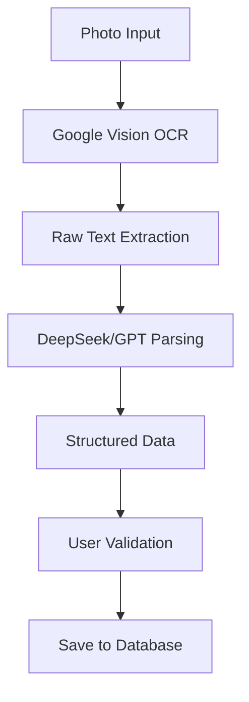

# AI & Automation

> **Entity**: (Cross-cutting)  
> **Status**: 🔴 TODO  
> **Version**: V1.0 (Foundation) → V3.0 (Intelligence)

---

## Current State

> See [Current State Mapping §10, §25](../00_overview/CURRENT_STATE_MAPPING.md)

| Feature | Exists | Implementation |
|---------|--------|----------------|
| AI Insights Panel | ✅ | Floating button → slide-out panel |
| Category insights | ✅ | Summary, Labour, Materials, Equipment, Subcon, Others |
| Update button | ✅ | Manual refresh |
| Team integration | ✅ | Settings tab with invite/search |

### Sample Insight Types

| Type | Example |
|------|---------|
| Collections | "Collect BR21964 >90d" |
| Labour | "Lift labour realisation on remaining hours" |
| Variation | "Recover October labour gap via variation" |
| Warning | "Labour realisation 30.6% below rate" |
| Cash flow | "AR >90 188.1k; urgent collection required" |
| Positive | "Materials 671.5k under budget" |

---

## Problem

Manual processes:
- Filing documents into folders
- Classifying emails to jobs
- Extracting data from scans
- Identifying trends and anomalies

Result: Hours of admin work, missed patterns, delayed response.

---

## Solution

AI-powered classification, extraction, and insight generation. Humans verify and override.

---

## AI Capabilities by Phase

### V1.0 — Foundation

| Capability | Description |
|------------|-------------|
| Email Classification | Route emails to correct job/category |
| File Classification | Route files to correct folder |
| Smart Search | Search across files and emails with context |
| Basic OCR | Extract text from scanned documents |

### V2.0 — Automation

| Capability | Description |
|------------|-------------|
| Day Sheet OCR | Photo → structured day sheet |
| Ticket OCR | Photo → structured license record |
| Project Notebook | Auto-generate project summary |
| Quote Reader | Excel/PDF → structured quote data |

### V3.0 — Intelligence

| Capability | Description |
|------------|-------------|
| Contract Analysis | Extract key terms and risks |
| Quote Builder | Generate quote from tender docs |
| Predictive Analytics | Forecast margin, cash flow |
| Natural Language Queries | "Show me losing jobs" |
| AI Insights Feed | Proactive recommendations |

---

## Classification Engine

### Email Classification

| Signal | Weight | Example |
|--------|--------|---------|
| Subject keywords | High | "Quote", "Variation", "Invoice" |
| Sender domain | Medium | Known client domains |
| Thread context | High | Reply to captured email |
| Body content | Medium | AI analysis |
| Attachment types | Low | PDF, Excel |

### Classification Confidence

| Confidence | Action |
|------------|--------|
| > 85% | Auto-assign |
| 50-85% | Suggest to user |
| < 50% | Flag for review |

### Learning from Corrections

When user overrides AI:
1. Log the correction
2. Update pattern database
3. Retrain classifier (batch)

---

## OCR Pipeline

### Day Sheet OCR (V2)



### Extraction Targets

| Field | Extraction Difficulty |
|-------|----------------------|
| Date | Easy |
| Worker names | Medium |
| Hours | Medium |
| Materials | Hard |
| Description | Medium |
| Signature present | Easy |

---

## Contract Analysis Agent (V3)

### Extracts

- Contract value and payment terms
- Scope summary
- Key dates (start, completion, DLP)
- Retention terms
- Insurance requirements
- Liquidated damages
- Variation process
- Dispute resolution

### Identifies Risks

- Unusual clauses
- Onerous terms
- Missing protections
- High-risk provisions

---

## Quote Ingestor (DeepSeek)

### Flow

1. Upload Excel/PDF quote
2. OCR/parse content
3. Identify structure (headers, rows, totals)
4. Map to Quotech schema
5. User reviews and confirms
6. Import to system

### Column Mapping

| Detected | Maps To |
|----------|---------|
| Description, Item, Scope | CostItem.description |
| Qty, Quantity, Units | CostItem.quantity |
| Rate, Cost, Unit Price | CostItem.unit_cost |
| Total, Amount, Subtotal | CostItem.total_cost |
| Labour, Install, Wages | category = labour |
| Material, Product, Supply | category = materials |

---

## AI Insights Panel

### Structure

```
┌────────────────────────────────────────────────┐
│  [AI Insights] [Notes] [Files] [Settings]      │
├────────────────────────────────────────────────┤
│                                                │
│  ▼ Summary                                     │
│  ├─ ⊙ Collect BR21964 >90d                    │
│  ├─ ⊙ Labour realisation 30.6% below rate    │
│  └─ ⊙ Materials 671.5k under budget          │
│                                                │
│  ▶ Labour (collapsed)                          │
│  ▶ Materials (collapsed)                       │
│  ▶ Equipment (collapsed)                       │
│  ▶ Subcontractors (collapsed)                  │
│  ▶ Others (collapsed)                          │
│                                                │
│                               [↻ Update]       │
└────────────────────────────────────────────────┘
```

### Insight Categories

| Category | Focus |
|----------|-------|
| Summary | Top actionable items |
| Labour | Hours, cost, productivity |
| Materials | Budget vs actual |
| Equipment | Utilization |
| Subcontractors | Spend tracking |
| Others | Miscellaneous |

---

## Automation Rules Engine

### Rule Structure

```
WHEN [event]
IF [conditions]
THEN [actions]
```

### Example Rules

| Event | Condition | Action |
|-------|-----------|--------|
| Email received | From client domain | Assign to client's job |
| Invoice overdue | Days > 30 | Send reminder |
| Ticket expiring | Days to expiry ≤ 30 | Warn worker |
| Quote approved | Client said yes | Change status to Won |
| Day sheet submitted | Supervisor = PM | Auto-approve |

---

## Guardrails

### Human Review Required

- Contract terms extraction
- Financial calculations
- Compliance determinations
- Client-facing content

### Audit Trail

All AI actions logged:
- What AI did
- Confidence score
- Context used
- User override (if any)
- Timestamp

---

## Technology Stack

| Component | Options |
|-----------|---------|
| LLM | DeepSeek (structured), GPT-4 (reasoning), Claude (docs) |
| OCR | Google Vision, AWS Textract |
| Search | Elasticsearch, Pinecone (vector) |
| Classification | Custom model + LLM |

---

## Open Questions

| Question | Status |
|----------|--------|
| Primary LLM provider? | Cost vs capability |
| On-premise option? | For sensitive customers |
| Per-company tuning? | Accuracy vs complexity |
| AI cost allocation? | Pass-through or bundled |

---

## Acceptance Criteria

### V1

- [ ] Email auto-classification
- [ ] File auto-classification
- [ ] Search across files and emails
- [ ] User can correct classifications
- [ ] AI learns from corrections

### V2

- [ ] Day sheet OCR
- [ ] Ticket OCR
- [ ] Project notebook generation
- [ ] Quote ingestor (Excel)

### V3

- [ ] Contract analysis
- [ ] AI chat interface
- [ ] Predictive insights
- [ ] Quote builder from docs
